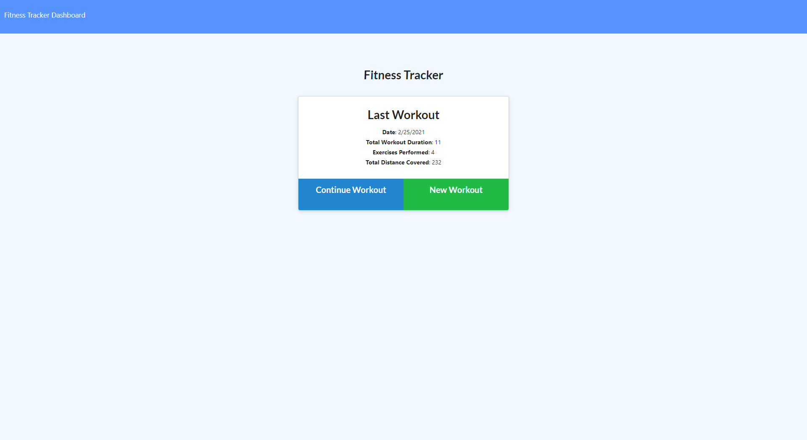

# FitnessApp

## About:  This app is designed to track a users exercise activties by logging important statistics into a database and having those statistics dispalyed to the user.
Users are able to track both cardio and resistance exercises.  Users who want to have a more visual representation of their statistaics can view a graph on the dashboard
page (work in progress).  

## Usage Instructions:  To use this app, users most hit the new workout button on the main page to add a new workout to the database.  Once a new workout has been added, 
users can choose to either add a new workout upon their next visit to the app, or continue an existing workout.  Users are able to select between cardio and resistance exercises 
and will need to add their statistics.  Users can get a visual representation of their statistics via the Dashboard

## Image of app 